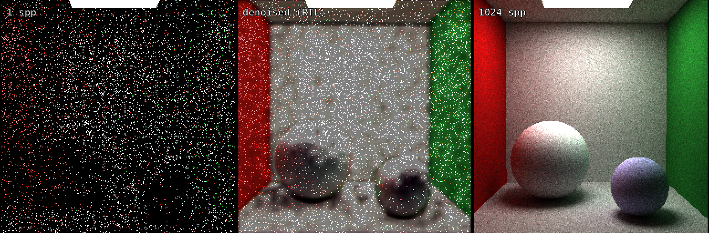

# ternoise


> A ray-tracing denoiser with **zero multipliers** — ternary weights, add/sub only, bound for an FPGA.



*Left: the 1-spp path-traced input (7.06 dB PSNR vs reference). Middle: denoised by the SystemVerilog design — every weight is -1, 0, or +1, zero multiplier cells in the netlist (+6.76 dB, bit-exact with the PyTorch integer path). Right: the 1024-spp reference.*

**Status: the full chain works in simulation.** A trained ternary network denoises real 1-spp frames (+6.76 dB over the input) through SystemVerilog that is bit-exact with the PyTorch integer path — 17 cycles/pixel, zero multiplier cells asserted on every CI run. No hardware has been purchased yet, and that's deliberate (see [Roadmap](#roadmap)).

---

## The pitch

Real-time ray tracing produces one sample per pixel and a lot of noise. The industry's answer is to clean it up with neural networks running in FP16/FP32 on tensor cores — powerful, but expensive silicon doing expensive math.

**ternoise** asks a simpler question: what happens to a convolutional denoiser when every weight is forced to be **−1, 0, or +1** (the "1.58-bit" ternary scheme popularized by [BitNet b1.58](https://arxiv.org/abs/2402.17764))?

The multiply disappears:

| Weight | `Y += W × X` becomes |
|:------:|----------------------|
| `+1`   | `Y += X` — an addition |
| `−1`   | `Y −= X` — a subtraction |
| `0`    | nothing at all |

A convolution collapses into a tree of adders and multiplexers. On an FPGA that means **no DSP slices, no floating point IP — just LUTs**. This project is a proof-of-concept that a network this brutally quantized can still denoise a 1-spp path-traced image well enough to matter, and that the resulting hardware is almost embarrassingly simple.

## The pipeline

```
┌─────────────────────────┐    INT8 stream     ┌──────────────────────────────┐
│  Host (C++ / OpenGL)    │  RGB+normal+depth  │  FPGA (SystemVerilog)        │
│                         │ ─────────────────► │                              │
│  1-spp path tracer      │                    │  line buffers → 3×3 windows  │
│  (compute shader)       │                    │  ternary conv PE array       │
│  G-buffer capture       │ ◄───────────────── │  (add/sub only, no DSPs)     │
│  quantize / display     │   denoised INT8    │  shift-round-clamp requant   │
└─────────────────────────┘                    └──────────────────────────────┘
                 ▲                                          ▲
                 │            ┌──────────────┐              │
                 └── weights ─┤ PyTorch QAT  ├─ .mem files ─┘
                              │ (offline)    │
                              └──────────────┘
```

Three implementations of the same network, all required to agree **bit-for-bit**:

1. **PyTorch** (`model/`) — quantization-aware training with a straight-through estimator, plus an integer-only eval path.
2. **C++ golden model** (`sim/`) — a deliberately boring, integer-only reference implementation. Clarity over speed.
3. **SystemVerilog RTL** (`rtl/`) — the actual streaming hardware, verified against the golden model in [Verilator](https://www.veripool.org/verilator/) with **zero tolerance**: every output pixel of every layer must match exactly.

A shared set of golden test vectors (`vectors/`) is the single source of truth all three are diffed against.

## The engineering contract

The interesting problems in this project aren't the network — they're the places where "almost right" silently breaks bit-exactness or smuggles a multiplier back into the datapath. The rules live in `docs/QUANT_SPEC.md`; the two that shaped the design:

**Requantization scales are powers of two — only.** Between layers, INT32 accumulators must be rescaled back to INT8. BitNet-style schemes normally use an arbitrary fixed-point scale here — which is a *multiplication*, which would quietly betray the entire "zero multipliers" claim. Restricting scales to powers of two turns requantization into an arithmetic shift + round + clamp. Slightly worse accuracy, honestly earned hardware claim.

**16-bit accumulators are not enough.** A 3×3 ternary conv over `C_in` channels can accumulate up to `9 · C_in · 128` in magnitude. At 32 input channels that's 36,864 — past the ±32,767 of an INT16. The accumulator width rule is `ceil(log2(9 · C_in · 128)) + 1` bits, sized per layer. Off-by-one-bit overflow bugs are exactly the kind of thing bit-exact cross-checking exists to catch *before* they're burned into RTL.

## The network (v1)

Deliberately not a U-Net:

- 5 layers of 3×3 ternary convolutions, 16–32 channels, ReLU
- Input: 7 channels — noisy RGB + world normals + linear depth, all INT8
- Output: an RGB **residual** added to the noisy input (residual learning is what makes a network this small viable — the G-buffers do the edge-preserving work, the net learns what to blend)
- Trained on pairs rendered by this repo's own path tracer: 1 spp (noisy) vs accumulated high-spp (reference)

If v1 denoises acceptably, a micro U-Net is the follow-up experiment — not the starting point.

## Roadmap

Simulation-first: the entire pipeline — including "hardware" — runs on a desktop before any board is bought. Verilator wraps the synthesized-quality RTL as a library the renderer calls directly, so the end-to-end demo exists first, and the board is chosen from real synthesis numbers (LUTs/BRAM) instead of guesswork.

- [x] **M0 — Quantization contract.** `docs/QUANT_SPEC.md` + golden test vectors. Every later component obeys this document.
- [x] **M1 — Bit-exact twins.** PyTorch `BitConv2d` + C++ golden model + 2-bit weight packer, all matching the vectors exactly.
- [x] **M2 — The renderer.** OpenGL 4.3 compute-shader path tracer: 1-spp noisy frames, G-buffers, accumulation mode, batch dataset dump.
- [x] **M3 — Proof in software.** Trained with QAT, calibrated to power-of-two shifts, exported through the packer; the C++ model denoises validation frames bit-exact vs PyTorch. Gate passed: **+6.76 dB PSNR** over the noisy baseline (7.06 dB -> 13.83 dB val average).
- [x] **M4 — The hardware.** Line buffers → ternary PE array → full net in SystemVerilog, bit-exact against the golden model in Verilator on trained 256px frames at **17 cycles/pixel** (~88 fps at 100 MHz). Yosys asserts **zero DSP/multiplier cells** on every CI run; 63.7k LUTs / 24 BRAM36 today, with a known LUT reduction queued for M5.
- [ ] **M5 — Hardware-in-the-loop.** Live demo: render → Verilated FPGA model → denoised frames on screen. Synthesis numbers → pick a real board. Board bring-up becomes its own chapter.

## Building in public

This project is being built in the open — decisions, dead ends, and overflow bugs included. The [`devlog/`](devlog/) has the running notes; milestone write-ups get posted as they land. Questions, corrections, and "this will never work because…" takes are all welcome in the issues.

## License

[MIT](LICENSE)
